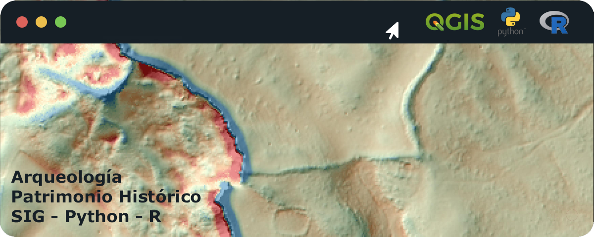

# Hola, mi nombre es Miguel Crespo 👋
### 🗿 Arqueología y Patrimonio Histórico computacional 💻

Soy arqueólogo y he comenzado a utilizar GitHub para colaborar y compartir con la comunidad códigos relacionados con la investigación arqueológica y la tutela del patrimonio histórico. 

Mi objetivo es, por un lado, devolver todo el conocimiento que la comunidad ha compartido conmigo de forma gratuita a lo largo de los años, así como ayudar a que más personas puedan acceder a su estudio, y por otro lado, colaborar con la comunidad en el desarrollo de códigos relacionados con la Arqueología y el Patrimonio Histórico.

- 🌍 QGIS
- 🐍 Python
- 📊 R
- 🐘 SQL

## Algunos de mis códigos:
- Para entorno RStudio:
    - [Calculadora de plazos administrativos, en días, para la Administración Pública](https://github.com/migueljcrespos/Calendario_plazos_admon)
- Para QGIS, consola Python:
    - [Crear Entornos de Protección de BIC de forma automática (disposición adicional 4ª Ley 14/2007 LPHA)](https://github.com/migueljcrespos/Entorno_BIC_DA4)
    - [Unificar capas de Catastro de varios municipios](https://github.com/migueljcrespos/Unificar_Catastro)

